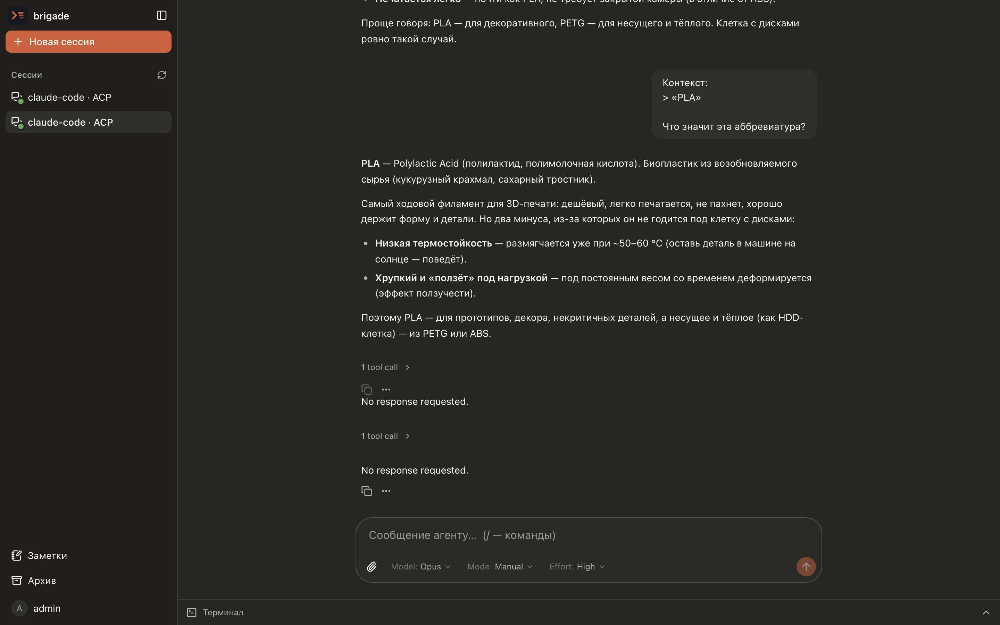
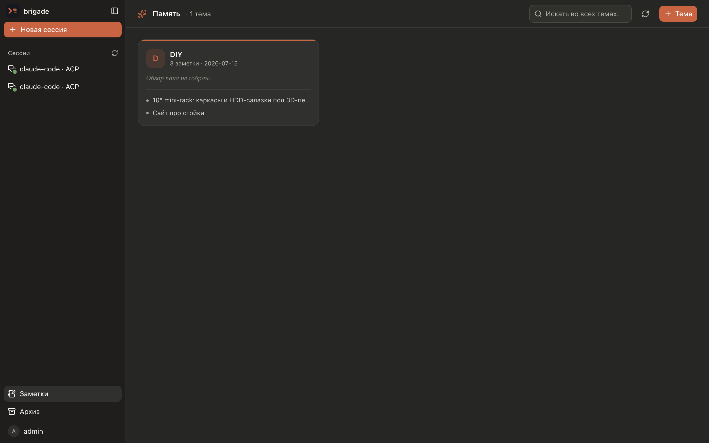
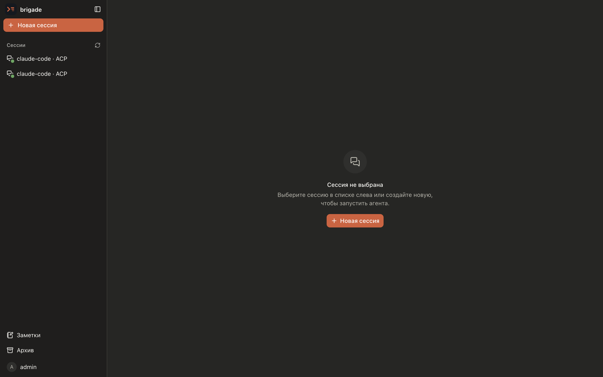

<p align="center">
  
</p>

<h1 align="center">brigade</h1>

<p align="center">
  Self-hosted multiplexer for coding agents.<br/>
  Run Claude Code sessions on your own hardware — talk to them from any browser.
</p>

<p align="center">
  <a href="https://grigory51.github.io/brigade">Website</a> ·
  <a href="https://github.com/grigory51/brigade/releases">Releases</a> ·
  <a href="#quick-start">Quick start</a>
</p>

---

brigade is a single Go binary that spawns coding agents (Claude Code today, anything
speaking [ACP](https://agentclientprotocol.com) tomorrow), keeps their sessions alive on
the server, and mirrors them to a web UI — or a native **macOS desktop app**. Close the
laptop, open the phone — the agent keeps working, the session is right where you left it.

## Features

- **Two session modes** — full terminal (pty + xterm.js) or structured chat
  (ACP → AG-UI over SSE) with tool-call cards, diffs, plans and permission prompts.
- **Local or Docker isolation** — agents run as host processes or one container per
  session; sessions survive backend restarts (resume via agent state).
- **Session tree** — fork any chat session into an independent branch with full context.
- **Personal memory (git-backed)** — you and the agent save notes to a private,
  searchable store: markdown committed to your own git repo, organized into topics,
  surviving session deletion. The agent gets a `/note` skill to write to it.
- **Preview proxy** — a dev server started by the agent is instantly reachable at
  `https://<session>-<port>.your.domain` (built-in L7 proxy + TLS, no external
  reverse proxy needed). The agent gets a skill telling it how to publish ports.
- **Side terminal** — open a shell next to any session to inspect the working
  directory by hand.
- **Model switcher, slash commands, live usage** — session config is driven by the
  agent itself over ACP.
- **Push notifications** — per-user [ntfy](https://ntfy.sh) pings when a turn finishes
  or fails, so you can close the tab and get pinged when the agent needs you.
- **Desktop & mobile** — a native macOS app (`make app` → `Brigade.app`) and a Kotlin
  Multiplatform mobile client, both on the same backend.

## Screenshots

Structured ACP chat — tool-call cards, quoted context, model / mode / effort:



Git-backed memory and the session list:

|  |  |
|:---:|:---:|

## Quick start

Requirements: a [Claude subscription token](https://docs.anthropic.com/claude-code)
(`claude setup-token`), and Docker if you want containerized sessions.

```sh
# prebuilt binary (linux/amd64) — embeds the web UI
curl -L https://github.com/grigory51/brigade/releases/latest/download/brigade-linux-amd64.tar.gz | tar xz
./brigade --config config.yaml   # bring your own config.yaml → http://localhost:8080
```

or build from source (`make app` also produces the macOS desktop `Brigade.app`):

```sh
git clone https://github.com/grigory51/brigade && cd brigade
make build
cp backend/config.example.yaml backend/config.yaml   # edit: seed user, jwt secret
make run                                             # → http://localhost:8080
```

or with Docker:

```sh
# BRIGADE_MODE=docker runs each session in its own container; it needs the host
# docker socket, and the workspace + claude-home dirs must be mounted at the SAME
# path inside and outside the container (brigade passes these paths to the host
# Docker daemon for session bind-mounts).
docker run -d --name brigade \
  -p 8080:8080 \
  -v /var/run/docker.sock:/var/run/docker.sock \
  -v brigade-data:/data \
  -v /srv/brigade/workspace:/srv/brigade/workspace \
  -v /srv/brigade/claude:/srv/brigade/claude \
  -e BRIGADE_MODE=docker \
  -e BRIGADE_WORK_DIR=/srv/brigade/workspace \
  -e BRIGADE_CLAUDE_HOME_DIR=/srv/brigade/claude \
  -e BRIGADE_JWT__SECRET=change-me \
  ghcr.io/grigory51/brigade:latest
```

`BRIGADE_MODE` (`local` | `docker`) is set per instance — all its sessions inherit it,
users don't pick a mode. Docker mode also needs the agent image on the host:

```sh
docker build -t brigade/claude-agent:latest docker/claude-agent
# or: docker pull ghcr.io/grigory51/brigade-agent:latest
```

**Claude auth.** The Claude subscription token is no longer a global env var — each
brigade user sets their own in the UI (**Settings → Claude**, `claude setup-token`).
In docker mode, `BRIGADE_CLAUDE_HOME_DIR` gives each user a personal `~/.claude`
(`<dir>/<userID>`) bind-mounted into all their containers, so a one-time `/login` in a
CLI session is shared across their CLI and ACP sessions.

**Desktop app (macOS).** Prefer a native window to a browser tab? `make app` bundles a
self-contained `Brigade.app` (embeds node + the agent runtime) — the same brigade in a
native webview, with its config under `~/Library/Application Support/Brigade`.

## Configuration

YAML file plus env overrides (`BRIGADE_` prefix, `__` as the nesting separator):
`BRIGADE_MODE`, `BRIGADE_JWT__SECRET`, `BRIGADE_WORK_DIR`, `BRIGADE_CLAUDE_HOME_DIR`,
`BRIGADE_PREVIEW__DOMAIN`, … See
[`backend/config.example.yaml`](backend/config.example.yaml)
for the full annotated list, including exposing dev servers behind a wildcard
domain with built-in TLS.

## Architecture

```
browser (React + xterm.js + AG-UI)  ──►  brigade (single Go binary)
                                          ├─ ConnectRPC API + embedded SPA
                                          ├─ WS: terminal / side shell
                                          ├─ SSE: chat (ACP → AG-UI)
                                          ├─ L7 preview proxy (+ TLS)
                                          ├─ SQLite: sessions · users · memory
                                          └─ spawner: local pty │ docker
                                                        │
                                              claude-agent-acp (per session)
```

The protobuf contract in [`proto/`](proto) is the single source of truth for the API;
mobile (Kotlin Multiplatform) shares it. Personal notes live in a git repo of your own.

## Status

Early and moving fast. Interfaces may change without notice; use behind a VPN or on a
trusted network — preview links are intentionally public, and the seed user is a single
admin account.

## License

MIT
