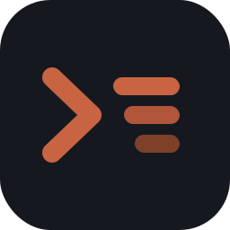

<p align="center">
  
</p>

<h1 align="center">brigade</h1>

<p align="center">
  Self-hosted multiplexer for coding agents.<br/>
  Run Claude Code sessions on your own hardware — talk to them from any browser.
</p>

---

brigade is a single Go binary that spawns coding agents (Claude Code today, anything
speaking [ACP](https://agentclientprotocol.com) tomorrow), keeps their sessions alive on
the server, and mirrors them to a web UI. Close the laptop, open the phone — the agent
keeps working, the session is right where you left it.

## Features

- **Two session modes** — full terminal (pty + xterm.js) or structured chat
  (ACP → AG-UI over SSE) with tool-call cards, diffs, plans and permission prompts.
- **Local or Docker isolation** — agents run as host processes or one container per
  session; sessions survive backend restarts (resume via agent state).
- **Session tree** — fork any chat session into an independent branch with full context.
- **Preview proxy** — a dev server started by the agent is instantly reachable at
  `https://<session>-<port>.your.domain` (built-in L7 proxy + TLS, no external
  reverse proxy needed). The agent gets a skill telling it how to publish ports.
- **Side terminal** — open a shell next to any session to inspect the working
  directory by hand.
- **Model switcher, slash commands, live usage** — session config is driven by the
  agent itself over ACP.

## Quick start

Requirements: a [Claude subscription token](https://docs.anthropic.com/claude-code)
(`claude setup-token`), and Docker if you want containerized sessions.

```sh
# binary (embeds the web UI)
git clone https://github.com/grigory51/brigade && cd brigade
make build
cp backend/config.example.yaml backend/config.yaml   # edit: seed user, jwt secret, token
make run                                             # → http://localhost:8080
```

or with Docker:

```sh
# Mount the docker socket to enable Docker session mode; the workspace must be
# mounted at the SAME path inside and outside the container, since brigade passes
# workspace paths to the host Docker daemon for session bind-mounts.
docker run -d --name brigade \
  -p 8080:8080 \
  -v /var/run/docker.sock:/var/run/docker.sock \
  -v brigade-data:/data \
  -v /srv/brigade/workspace:/srv/brigade/workspace \
  -e BRIGADE_WORK_DIR=/srv/brigade/workspace \
  -e BRIGADE_JWT__SECRET=change-me \
  -e BRIGADE_CLAUDE_CODE_OAUTH_TOKEN=sk-ant-oat01-... \
  ghcr.io/grigory51/brigade:latest
```

Each session picks local (host process) or Docker (one container per session) at
creation time — one instance serves both. Docker sessions become available when the
docker daemon is reachable (locally, or via a mounted socket). They also need the
agent image on the host:

```sh
docker build -t brigade/claude-agent:latest docker/claude-agent
# or: docker pull ghcr.io/grigory51/brigade-agent:latest
```

## Configuration

YAML file plus env overrides (`BRIGADE_` prefix, `__` as the nesting separator):
`BRIGADE_JWT__SECRET`, `BRIGADE_CLAUDE_CODE_OAUTH_TOKEN`, `BRIGADE_WORK_DIR`,
`BRIGADE_PREVIEW__DOMAIN`, … See [`backend/config.example.yaml`](backend/config.example.yaml)
for the full annotated list and [`docs/preview.md`](docs/preview.md) for exposing
dev servers behind a wildcard domain with built-in TLS.

## Architecture

```
browser (React + xterm.js + AG-UI)  ──►  brigade (single Go binary)
                                          ├─ ConnectRPC API + embedded SPA
                                          ├─ WS: terminal / side shell
                                          ├─ SSE: chat (ACP → AG-UI)
                                          ├─ L7 preview proxy (+ TLS)
                                          └─ spawner: local pty │ docker
                                                        │
                                              claude-agent-acp (per session)
```

The protobuf contract in [`proto/`](proto) is the single source of truth for the API;
mobile (Kotlin Multiplatform) shares it.

## Status

Early and moving fast. Interfaces may change without notice; use behind a VPN or on a
trusted network — preview links are intentionally public, and the seed user is a single
admin account.

## License

MIT
