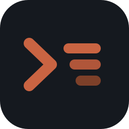

<p align="center">
  
</p>

<h1 align="center">brigade</h1>

<p align="center">
  Self-hosted workspace for coding agents.<br/>
  Run Claude Code and Codex on your own hardware — use them from any browser or Telegram.
</p>

<p align="center">
  <a href="https://grigory51.github.io/brigade">Website</a> ·
  <a href="https://grigory51.github.io/brigade/docs/">Documentation</a> ·
  <a href="https://github.com/grigory51/brigade/releases">Releases</a> ·
  <a href="#quick-start">Quick start</a>
</p>

---

brigade is a Go service with an embedded React UI. It starts Claude Code and Codex
sessions, keeps them running when the browser disconnects, and restores them after a
backend restart. Use a full terminal or structured ACP chat from the web UI and the
native macOS app.

## Features

- **Claude Code and Codex** — add multiple named agent connections, including several
  accounts of the same provider, then choose a connection for each session. Claude
  accepts a subscription token; Codex supports ChatGPT device login and OpenAI API keys.
- **CLI or ACP chat** — use a full pty through xterm.js, or structured ACP → AG-UI chat
  with diffs, plans, permission controls, slash commands, model settings and live usage.
- **Local or Docker runtime** — run agents as host processes or in Docker. ACP sessions
  get isolated containers; CLI sessions share one long-lived container per user. Custom
  user images are supported, while brigade injects its runtime separately.
- **Live session controls** — reload the agent runtime, open a movable side terminal,
  jump through long chats with Time Machine, and collect links emitted by the agent.
- **Per-user MCP** — add stdio, HTTP or SSE servers, select them when creating a session,
  and enable or disable them in a running ACP session. Secret environment variables and
  headers use references to values stored in brigade's encrypted server-side vault.
- **Generative UI and files** — agents can render interactive A2UI cards, publish files,
  return generated images, and show GLB/GLTF or CAD models directly in chat. Workspace
  file downloads use authenticated session URLs.
- **Personal memory and archive in git** — notes are searchable Markdown in your own
  private repository. Archiving a session commits its complete read-only chat under
  `archive/`; deleting a session removes it permanently.
- **Telegram bots** — connect your own BotFather token and choose an agent connection,
  image and MCP set. Direct chats and forum topics map to brigade sessions;
  sessions from one bot are grouped in the sidebar, and replies support formatted text,
  files and images. Instances use polling or webhooks; the desktop app always polls.
- **Notifications** — connect multiple notification destinations per user. The backend
  supports multiple providers and connections; ntfy is the first implemented provider.
- **Preview proxy** — expose an agent's dev server through a per-session URL using the
  built-in L7 proxy and optional TLS. Subdomain and single-host cookie routing are
  supported.
- **SSH keys stay in memory** — brigade exposes the user's key through an in-process
  ssh-agent to sessions and the memory repository instead of writing private keys into
  workspaces.

## Quick start

Add at least one named agent connection after signing in: Claude with a subscription
token, or Codex through ChatGPT device login / an OpenAI API key. You can keep multiple
Claude and Codex accounts in one profile. Docker is only required for containerized
sessions.

### Prebuilt binary

The release archive contains a Linux amd64 binary with the web UI embedded:

```sh
curl -LO https://raw.githubusercontent.com/grigory51/brigade/main/backend/config.example.yaml
mv config.example.yaml config.yaml
curl -L https://github.com/grigory51/brigade/releases/latest/download/brigade-linux-amd64.tar.gz | tar xz

# Edit config.yaml: change jwt.secret and the seed credentials.
./brigade --config config.yaml
# http://localhost:8080
```

### Build from source

```sh
git clone https://github.com/grigory51/brigade
cd brigade
make build
cp backend/config.example.yaml backend/config.yaml
# Edit backend/config.yaml: change jwt.secret and the seed credentials.
make run
```

Each [GitHub release](https://github.com/grigory51/brigade/releases/latest) includes an
Apple Silicon DMG. `make app` builds the same macOS `Brigade.app` from source. It bundles
Node and installs or updates the Claude/Codex runtime in the user's application data on launch. In the desktop UI,
**Settings → Agent environment** can switch between local processes and a Docker context.

### Docker

Docker mode uses the host daemon. The state directory must have the same absolute path
inside the brigade container and on the host because session bind mounts are created by
that host daemon.

```sh
mkdir -p /srv/brigade/{workspace,agent-home,memory}

docker run -d --name brigade --restart unless-stopped \
  -p 8080:8080 \
  -v /var/run/docker.sock:/var/run/docker.sock \
  -v /srv/brigade:/srv/brigade \
  -e BRIGADE_MODE=docker \
  -e BRIGADE_SQLITE_PATH=/srv/brigade/brigade.db \
  -e BRIGADE_WORK_DIR=/srv/brigade/workspace \
  -e BRIGADE_AGENT_HOME_DIR=/srv/brigade/agent-home \
  -e BRIGADE_MEMORY__DIR=/srv/brigade/memory \
  -e BRIGADE_AGENT_IMAGE=ghcr.io/grigory51/brigade-agent:latest \
  -e BRIGADE_JWT__SECRET=change-me \
  ghcr.io/grigory51/brigade:latest
```

The published agent image is the default runtime and the donor for custom user images.
To build it locally instead:

```sh
docker build -t brigade/agent:latest -f packaging/docker/agent/Dockerfile .
```

## Configuration

Configuration is YAML with environment overrides: prefix `BRIGADE_`, and `__` between
nested fields. Examples: `BRIGADE_MODE`, `BRIGADE_JWT__SECRET`,
`BRIGADE_AGENT_HOME_DIR`, `BRIGADE_PREVIEW__DOMAIN`, and
`BRIGADE_TELEGRAM__MODE`.

See [`backend/config.example.yaml`](backend/config.example.yaml) for the annotated list.
Runtime mode and Telegram polling/webhook transport belong to the instance. Agent
connections, custom images, MCP servers, notification connections, Telegram bot tokens
and memory remotes belong to individual users and are configured in the UI.

## Architecture

```text
browser / Brigade.app / Telegram
              │
              ├─ ConnectRPC
              ├─ WebSocket: terminal and shell
              └─ SSE: ACP → AG-UI, including A2UI events
              │
      brigade (single Go binary)
              ├─ embedded React UI
              ├─ auth, settings and session registry → SQLite
              ├─ notes and archived chats → user's git repository
              ├─ preview and authenticated session-file endpoints
              └─ local or Docker spawner
                         ├─ Claude Code: claude / claude-agent-acp
                         └─ Codex: codex / codex-acp
```

The protobuf files in [`proto/`](proto) are the API source of truth. Raw WebSocket and
SSE transports are reserved for terminal and streaming chat protocols that ConnectRPC
does not represent. A Kotlin Multiplatform client scaffold also lives in `mobile/`, but
it is not currently shipped as a supported mobile application.

## Status

Early and moving fast. Interfaces may change without notice. Run brigade behind a VPN or
on a trusted network; preview URLs are intentionally public when the preview proxy is
enabled. Replace the default seed credentials and JWT secret before exposing an instance.

## License

MIT
